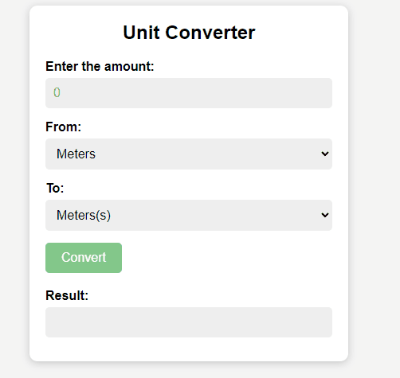

---- English ----

Coming soon

---- Português ----

# Conversor de medidas
Este projeto prático de javascript tem como objetivo de simular uma calculadora de medidas entre quilômetros, metros, decimetros e milimetros.

_Observação: Para visualizar o preview do projeto clique na imagem acima._
______________________

### Descrição
Com o uso do DOM, podemos selecionar elementos por classes ou IDs e, em seguida, aplicar cálculos matemáticos com um pouco de lógica. Essa abordagem inicial cria oportunidades para a incorporação de outras unidades de medida em nossos cálculos. Embora o layout não tenha sido o foco principal, procurei manter um estilo 'clean' e seguir as melhores práticas de hierarquia e código limpo no desenvolvimento. Além disso, optei por uma estrutura de pastas simples, porém intuitiva.

## Funcionalidades
- Conversão entre quilômetros, metros, decímetros e milímetros.
- Interface simples e amigável.

## Como Usar
1. Insira o valor que deseja converter.
2. Selecione a unidade de origem.
3. Selecione a unidade de destino.
4. Clique em "Converter".

### Instalação
Não é necessário instalação.

### Dependências
Não há dependências.

### Tecnologias usadas

### Minhas redes
[Linkedin](https://www.linkedin.com/in/gleriston/) | [Codepen](https://codepen.io/GleristonCastro) | [Dev.to](https://dev.to/gleristoncastro) | [Youtube](https://www.youtube.com/@GleristonCastro)