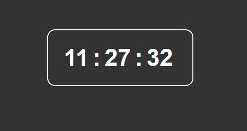

# Digital Clock
This project consists of creating a simple digital clock using JavaScript's native Date() function. The focus was not on the layout, as there is room for future improvements.

_Note: To view the project preview, click on the image above._

______________________

### Description
Using the DOM, we can select elements by classes or IDs and then apply mathematical calculations with a bit of logic. This initial approach opens up opportunities for using date functions and continuous updates with setInterval().

### Features
- Digital clock based on the local time of the device.

### How to Use
No usage instructions are needed.

### Installation
No installation is required.

### Dependencies
There are no dependencies.

### Technologies Used

### My Social Media
[Linkedin](https://www.linkedin.com/in/gleriston/) | [Codepen](https://codepen.io/GleristonCastro) | [Dev.to](https://dev.to/gleristoncastro) | [Youtube](https://www.youtube.com/@GleristonCastro)

# Relógio digital
Este projeto consiste em criar um relógio digital simples utilizando a função nativa do JavaScript Date(). O foco não foi o layout, visto que há oportunidade para melhorias futuras.

_Observação: Para visualizar o preview do projeto clique na imagem acima._
______________________

### Descrição
Com o uso do DOM, podemos selecionar elementos por meio de classes ou IDs e, em seguida, aplicar cálculos matemáticos com um pouco de lógica. Essa abordagem inicial abre oportunidades para a utilização de funções de data (date) e atualizações contínuas com o setInterval().

## Funcionalidades
- Relógio digital com base no horário local do dispositivo.

## Como Usar
Não há necessidade de instruções de uso

### Instalação
Não é necessário instalação.

### Dependências
Não há dependências.

### Tecnologias usadas

### Minhas redes
[Linkedin](https://www.linkedin.com/in/gleriston/) | [Codepen](https://codepen.io/GleristonCastro) | [Dev.to](https://dev.to/gleristoncastro) | [Youtube](https://www.youtube.com/@GleristonCastro)