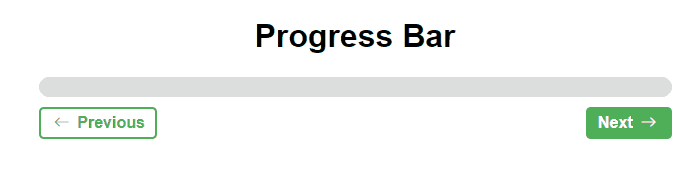

# Progress Bar
With this project, a progress bar is created that increases or decreases as we move to the next page. The idea is to simulate, for example, a multi-step user registration process.

_Note: To view the project preview, click on the image above._

### Description
In this project, using JavaScript, it was possible to make references to DOM elements to add or remove percentages. This way, when added or removed in conjunction with CSS, we can observe the animation. In a future use, simply create the 'steps' variable and thus perform a division within the code itself to reach the final value of 100%.

### Features
- Clicking "Next" increases the progress bar by 10%.
- Clicking "Previous" decreases the progress bar by 10%.
- There are constraints to prevent the bar from going below zero or exceeding 100.

### How to Use
No usage instructions are needed.

### Installation
No installation is required.

### Dependencies
There are no dependencies.

### Technologies Used

### My Social Media
[Linkedin](https://www.linkedin.com/in/gleriston/) | [Codepen](https://codepen.io/GleristonCastro) | [Dev.to](https://dev.to/gleristoncastro) | [Youtube](https://www.youtube.com/@GleristonCastro)
______________________

# Barra de progresso
Com este projeto, é criada uma barra de progresso que é aumentada ou diminuída à medida que avançamos para a próxima página. A ideia é simular, por exemplo, um processo de cadastro de usuário em várias etapas.

_Observação: Para visualizar o preview do projeto clique na imagem acima._

### Descrição
Neste projeto, usando JavaScript, foi possível fazer algumas referências a elementos do DOM para adicionar ou remover porcentagens. Dessa forma, ao serem adicionadas ou removidas em conjunto com o CSS, podemos observar a animação. Em um uso futuro, basta criar a variável 'steps' e, assim, realizar uma divisão dentro do próprio código para alcançar o valor final de 100%.

## Funcionalidades
- Ao clicar em "Próximo", a barra de progresso aumenta em 10%.
- Ao clicar em "Anterior", a barra de progresso diminui em 10%..
- Existem restrições para impedir que a barra ultrapasse valores menores que zero ou maiores que 100.

## Como Usar
Não há necessidade de instruções de uso

### Instalação
Não é necessário instalação.

### Dependências
Não há dependências.

### Tecnologias usadas

### Minhas redes
[Linkedin](https://www.linkedin.com/in/gleriston/) | [Codepen](https://codepen.io/GleristonCastro) | [Dev.to](https://dev.to/gleristoncastro) | [Youtube](https://www.youtube.com/@GleristonCastro)