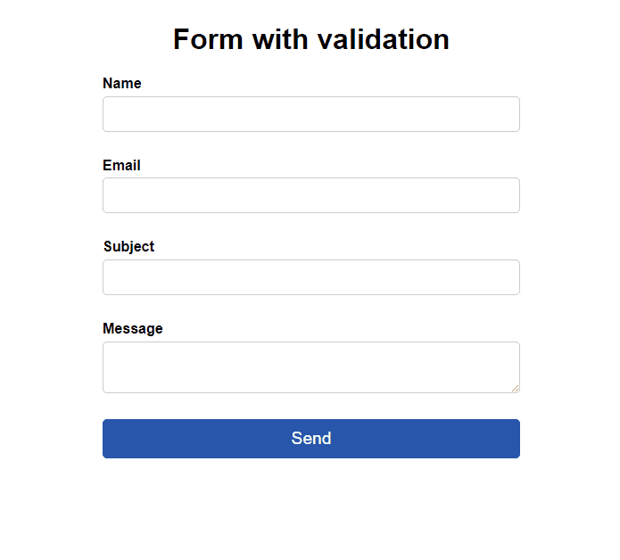

#  Form with validation
In this project, we have a form with validation for important aspects, intended for a potential registration page. We use native HTML elements to ensure security, and we further enhance validation with JavaScript.

_Note: To view the project preview, click on the image above._

### Description
The project includes crucial validations, such as checking if there is input data in the input field. In the case of email, validation solely through the HTML attribute 'type="email"' is insufficient, as it would allow, for instance, an email like 'a@a'. By using Regex, we can now improve this validation. The form features visual alerts that allow field highlighting through labels.

For future enhancements, we can employ APIs to verify the validity of email addresses, check if an email is in a spam blacklist, and implement other features, such as adding a Captcha.

### Features
- Checks if fields have been filled.
- Validates if the email is compliant with Regex parameters.

### How to Use
To simulate the protections, upon opening the page, click the "Send" button and observe the guidance below each input field. It's also valid to fill one field at a time and attempt to submit the form to follow the validation of each field.

### Installation
No installation is required.

### Dependencies
There are no dependencies.

### Technologies Used

### My Social Media
[Linkedin](https://www.linkedin.com/in/gleriston/) | [Codepen](https://codepen.io/GleristonCastro) | [Dev.to](https://dev.to/gleristoncastro) | [Youtube](https://www.youtube.com/@GleristonCastro)
______________________

# Formulário com validação
Neste projeto, temos um formulário com validação de aspectos importantes para uma eventual página de cadastro. Utilizamos elementos HTML nativos para garantir segurança, bem como reforçamos a validação com JavaScript.

_Observação: Para visualizar o preview do projeto clique na imagem acima._

### Descrição
O projeto apresenta validações importantes, como verificar se há dados digitados no campo de entrada. No caso do e-mail, a validação apenas pelo atributo HTML 'type='email'' é insuficiente, pois permitiria, por exemplo, um e-mail como 'a@a'. Usando Regex, agora conseguimos aprimorar essa verificação. O formulário conta com avisos visuais que permitem destacar campos por meio de etiquetas ('labels').

Em futuras melhorias, podemos utilizar APIs para verificar se o endereço de e-mail é válido, se o e-mail está na lista negra de spam e outras funcionalidades, como a implementação de um meio de Captcha.

## Funcionalidades
- Verifica se os campos foram preenchidos.
- Verifica se o email é válido de acordo com os parâmetros do Regex.

## Como Usar
Para simular as proteções, ao abrir a página, clique no botão "Send" e observe as orientações abaixo de cada campo de entrada. Também é válido preencher um campo por vez e tentar enviar o formulário para acompanhar a validação de cada campo.

### Instalação
Não é necessário instalação.

### Dependências
Não há dependências.

### Tecnologias usadas

### Minhas redes
[Linkedin](https://www.linkedin.com/in/gleriston/) | [Codepen](https://codepen.io/GleristonCastro) | [Dev.to](https://dev.to/gleristoncastro) | [Youtube](https://www.youtube.com/@GleristonCastro)