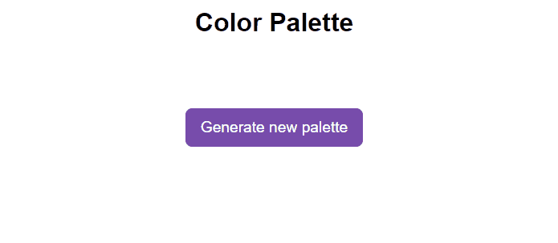

# Color Palette
Sometimes, we don't know which color palette to use in our project. With this small project that generates random colors in HEX format, I hope we can solve this problem.

_Note: To view the project preview, click on the image above._

### Description
In this project, we can generate a color palette in HEX format with the help of JavaScript and its Math.floor and Math.Random functions. The scope of colors ranges from 0 to 9 and from A to F, allowing you to create combinations (although not always harmonious). You can generate multiple palettes until you find one that satisfies your preferences. It's worth noting that this is just an example of JavaScript functionality and is not based on scientific criteria for determining the best combinations.

### Features
- Generate a palette containing 6 suggested colors.

### How to Use
Click "Generate new palette" to create the color palette.

### Installation
No installation is required.

### Dependencies
There are no dependencies.

### Technologies Used

### My Social Media
[Linkedin](https://www.linkedin.com/in/gleriston/) | [Codepen](https://codepen.io/GleristonCastro) | [Dev.to](https://dev.to/gleristoncastro) | [Youtube](https://www.youtube.com/@GleristonCastro)
______________________

# Paleta de cores
Às vezes, não sabemos qual paleta de cores usar em nosso projeto. Com este pequeno projeto que gera cores aleatórias no formato HEX, espero que possamos resolver esse problema.

_Observação: Para visualizar o preview do projeto clique na imagem acima._

### Descrição
Neste projeto, podemos gerar uma paleta de cores no formato HEX com a ajuda do JavaScript e suas funções Math.floor e Math.Random. O escopo das cores abrange de 0 a 9 e de A até F, permitindo criar combinações (embora nem sempre harmoniosas). É possível gerar várias paletas até encontrar uma que satisfaça suas preferências. Vale ressaltar que isso é apenas um exemplo de funcionalidade do JavaScript e não se baseia em critérios científicos para determinar as melhores combinações.

## Funcionalidades
- Gerar uma paleta contendo 6 cores sugeridas.

## Como Usar
Clique em "Generate new pallette" para gerar a paleta de cores.

### Instalação
Não é necessário instalação.

### Dependências
Não há dependências.

### Tecnologias usadas

### Minhas redes
[Linkedin](https://www.linkedin.com/in/gleriston/) | [Codepen](https://codepen.io/GleristonCastro) | [Dev.to](https://dev.to/gleristoncastro) | [Youtube](https://www.youtube.com/@GleristonCastro)