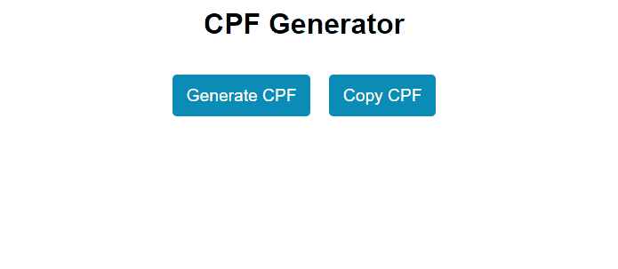

# CPF Generator
The CPF (Cadastro de Pessoa Física) is an official document issued by the Brazilian government, possessed by every citizen. There is a formula behind the generation of CPF, and in this project, we will delve into this generation to better understand it.

_Note: To view the project preview, click on the image above._

### Description
The CPF (Cadastro de Pessoa Física) is a document composed of 11 numbers, often formatted with an additional 3 digits (2 periods (.) and 1 hyphen (-)), which are optional in some cases. Typically, only the numbers are stored in databases. To generate a valid CPF, there are specific rules, and in the code, we address the verification of the final two digits, known as the verification digit 1 and verification digit 2. These digits allow us to validate the preceding numbers.

Note: Even though the CPF number may be valid, it is emphatically emphasized that this number should not be used. To obtain a regular CPF, it is necessary to seek institutions accredited by the Brazilian government. Any use of this code for illegal purposes is unauthorized. This code is commonly employed for study and project presentation purposes in JavaScript.

A curiosity about CPF is that the penultimate digit determines the region to which the CPF belongs.

### Features
- Generate a valid CPF number.

### How to Use
- Click on "Generate CPF."
- Click on "Copy CPF."
- Test the generated CPF at: https://www.4devs.com.br/validador_cpf

### Installation
No installation is required.

### Dependencies
There are no dependencies.

### Technologies Used

### My Social Media
[Linkedin](https://www.linkedin.com/in/gleriston/) | [Codepen](https://codepen.io/GleristonCastro) | [Dev.to](https://dev.to/gleristoncastro) | [Youtube](https://www.youtube.com/@GleristonCastro)
______________________

# Gerador de CPF
O CPF é um documento oficial do governo brasileiro que cada cidadão possui. Existe uma fórmula por trás da geração do CPF, e neste projeto, vamos abordar essa geração e entendê-la um pouco melhor.

_Observação: Para visualizar o preview do projeto clique na imagem acima._

### Descrição
O CPF (Cadastro de Pessoa Física) é um documento composto por 11 números, frequentemente formatados com mais 3 dígitos (2 pontos (.) e 1 traço (-)), que em alguns casos são opcionais. Normalmente, apenas os números são armazenados em bancos de dados. Para gerar um CPF válido, existem algumas regras, e no código, abordamos a verificação dos dois últimos dígitos, conhecidos como dígito verificador 1 e dígito verificador 2. Com esses dígitos, é possível verificar a validade dos números anteriores.

Atenção: Mesmo que o número de CPF seja válido, é enfaticamente destacado que este número não deve ser usado. Para obter um CPF regular, é necessário procurar instituições credenciadas pelo governo brasileiro. Qualquer uso deste código para fins ilegais é desautorizado. Este código é comumente utilizado para fins de estudo e apresentação de projetos em JavaScript.

Uma curiosidade sobre o CPF é que o antepenúltimo número determina a região à qual o CPF pertence.

## Funcionalidades
- Gerar um número de CPF válido.

## Como Usar
- Clique em "Generate CPF"
- Clique em "Copy CPF"
- Teste o CPF gerado em: https://www.4devs.com.br/validador_cpf

### Instalação
Não é necessário instalação.

### Dependências
Não há dependências.

### Tecnologias usadas

### Minhas redes
[Linkedin](https://www.linkedin.com/in/gleriston/) | [Codepen](https://codepen.io/GleristonCastro) | [Dev.to](https://dev.to/gleristoncastro) | [Youtube](https://www.youtube.com/@GleristonCastro)