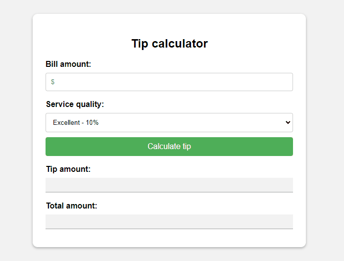

# Tip Calculator
The additional monetary gratuity, better known as a tip, in this project aims to make this calculation a little easier. Tips can be applied in restaurants, room service, and other settings.

_Note: To view the project preview, click on the image above._

### Description
Through this project, it is possible to calculate the tip by entering the service amount, which can be a whole number or a decimal. You can choose the level of satisfaction from the "Service Quality" list, which consequently determines the tip percentage. This will provide you with the tip amount and the total amount, including both the service and the tip. It is worth noting that in JavaScript, we use the "toLocaleString" function to format the currency according to the region.

### Features
- Calculate the tip amount.
- Visually facilitate and expedite the determination of values with and without a tip.

### How to Use
1. Enter the service amount in the first field.
2. Choose the satisfaction level from the list in the second field.
3. Click on "Calculate Tip."

### Installation
No installation is required.

### Dependencies
There are no dependencies.

### Technologies Used

### My Social Media
[Linkedin](https://www.linkedin.com/in/gleriston/) | [Codepen](https://codepen.io/GleristonCastro) | [Dev.to](https://dev.to/gleristoncastro) | [Youtube](https://www.youtube.com/@GleristonCastro)
______________________

# Calculadora de gorjeta
A gratificação adicional em forma de dinheiro, mais conhecida como gorjeta, neste projeto tem como objetivo facilitar um pouco esse cálculo. A gorjeta pode ser aplicada em restaurantes, serviços de quarto e outros.

_Observação: Para visualizar o preview do projeto clique na imagem acima._

### Descrição
Através deste projeto, é possível calcular a gorjeta informando o valor do serviço, que pode ser um número inteiro ou decimal. Você pode escolher o grau de satisfação na lista "Qualidade do Serviço", o que consequentemente reflete na porcentagem da gorjeta. Assim, você obterá o valor da gorjeta e o valor total, incluindo o serviço e a gorjeta. Vale destacar que no JavaScript, utilizamos a função "toLocaleString" para configurar a formatação da moeda de acordo com a região.

## Funcionalidades
- Calcular o valor da gorjeta.
- Facilitar visualmente e agilizar a determinação dos valores com e sem gorjeta.

## Como Usar
1. Digite o valor no primeiro campo referente ao serviço prestado.
2. Escolha na lista do segundo campo qual nível de satisfação.
3. Clique em "calculate tip"

### Instalação
Não é necessário instalação.

### Dependências
Não há dependências.

### Tecnologias usadas

### Minhas redes
[Linkedin](https://www.linkedin.com/in/gleriston/) | [Codepen](https://codepen.io/GleristonCastro) | [Dev.to](https://dev.to/gleristoncastro) | [Youtube](https://www.youtube.com/@GleristonCastro)