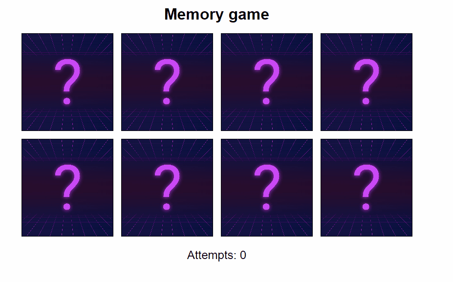

# Random Quotes

_Note: To view the project preview, click on the image above._

### Description

### Features
- 

### How to Use
No usage instructions are needed.

### Installation
No installation is required.

### Dependencies
There are no dependencies.

### Technologies Used

### My Social Media
[Linkedin](https://www.linkedin.com/in/gleriston/) | [Codepen](https://codepen.io/GleristonCastro) | [Dev.to](https://dev.to/gleristoncastro) | [Youtube](https://www.youtube.com/@GleristonCastro)
______________________

# Jogo da memória
Um dos jogos mais conhecidos da humanidade e que podemos simular através do JavaScript. Com este projeto, podemos estimular a memória visual, desenvolver a inteligência espacial e melhorar o foco e a concentração, entre outros benefícios.

_Observação: Para visualizar o preview do projeto clique na imagem acima._

### Descrição
Neste projeto, foi utilizada lógica para criar pares, além disso, utilizei a API Picsum para obter imagens aleatoriamente. Com a integração do DOM, é possível realizar a virada das cartas e jogar o jogo.

Problema conhecido: Após vários testes, identifiquei um erro na API quando a imagem não existe, resultando em cartas não viradas no jogo. A intenção para resolver isso é procurar outra API.

## Funcionalidades
Sem funcionalidades especificas para relatar.

## Como Usar
Não há necessidade de instruções de uso

### Instalação
Não é necessário instalação.

### Dependências
Não há dependências.

### Tecnologias usadas

### Minhas redes
[Linkedin](https://www.linkedin.com/in/gleriston/) | [Codepen](https://codepen.io/GleristonCastro) | [Dev.to](https://dev.to/gleristoncastro) | [Youtube](https://www.youtube.com/@GleristonCastro)