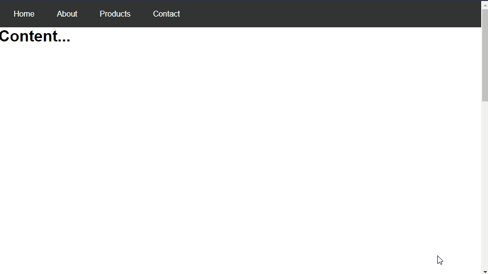

# Dropdown Menu and Back to Top
A simple yet quite useful project, both for creating dropdown menus and for the "back to top" functionality as you scroll through the screen.

_Note: To view the project preview, click on the image above._

### Description
In this rather simple project, you can already utilize various JavaScript functions related to screen scrolling and behavior. The dropdown menu was not created with JavaScript but rather with pure CSS. Sometimes, simplicity is what matters!

### Features
- Dropdown menu when hovering over the items.
- A "Back to Top" button that appears when scrolling exceeds 500px.

### How to Use
Hover the mouse cursor over the "Products" item and the other submenu options. Additionally, try scrolling down the page to the very end and click on the button that will appear in the bottom right corner of the screen to return to the top.

### Installation
No installation is required.

### Dependencies
There are no dependencies.

### Technologies Used

### My Social Media
[Linkedin](https://www.linkedin.com/in/gleriston/) | [Codepen](https://codepen.io/GleristonCastro) | [Dev.to](https://dev.to/gleristoncastro) | [Youtube](https://www.youtube.com/@GleristonCastro)
______________________

# Menu dropdown e voltar para o topo.
Um projeto simples, porém bastante útil, tanto para a criação de menus dropdown quanto para a função "voltar ao topo" conforme a rolagem da tela.

_Observação: Para visualizar o preview do projeto clique na imagem acima._

### Descrição
Neste projeto, bem simples, já é possível utilizar diversas funções do Javascript relacionadas à rolagem da tela e ao seu comportamento. O dropdown não foi criado com Javascript, apenas com CSS puro. Às vezes, a simplicidade é o que importa!

## Funcionalidades
- Menu dropdown ao passar o mouse sobre os itens.
- Botão "Voltar ao Topo" que aparece quando a rolagem passa de 500px.

## Como Usar
Passe o cursor do mouse sobre o item "Products" e as demais opções do submenu. Além disso, teste rolar a página até o final e clique no botão que aparecerá no canto inferior direito da tela para retornar ao topo.

### Instalação
Não é necessário instalação.

### Dependências
Não há dependências.

### Tecnologias usadas

### Minhas redes
[Linkedin](https://www.linkedin.com/in/gleriston/) | [Codepen](https://codepen.io/GleristonCastro) | [Dev.to](https://dev.to/gleristoncastro) | [Youtube](https://www.youtube.com/@GleristonCastro)