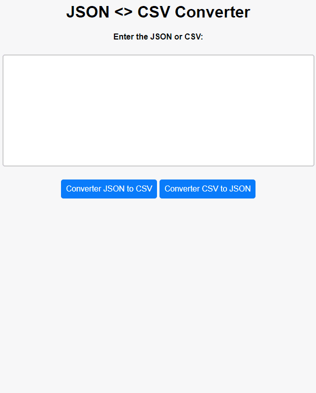

# JSON <> CSV Converter
In this project, we can address a highly useful functionality, especially when we need to migrate technology applications, which pertains to data transport.

_Note: To view the project preview, click on the image above._

### Description
In this project, with just a few lines of JavaScript code, you can change the data format from JSON to CSV and vice versa. Using the JavaScript "split" and "join" functions, we create compatible formats for migrating between the two types.

To perform the test, there is a file named "samples.txt" here with code to test both formats.

A future feature we could add would be automatic format detection.

### Features
- Convert from JSON to CSV.
- Convert from CSV to JSON.
- After the conversion, the JSON to CSV download starts automatically.
- When converting from CSV to JSON, the code appears below the buttons.

### How to Use
Copy the code from the attached/repository file ("samples.txt"), respecting the highlighted format delimitation. Paste it in the provided space and click on the corresponding format you wish to change.

### Installation
No installation is required.

### Dependencies
There are no dependencies.

### Technologies Used

### My Social Media
[Linkedin](https://www.linkedin.com/in/gleriston/) | [Codepen](https://codepen.io/GleristonCastro) | [Dev.to](https://dev.to/gleristoncastro) | [Youtube](https://www.youtube.com/@GleristonCastro)
______________________

# Conversor JSON <> CSV
Neste projeto, podemos abordar uma funcionalidade bastante útil, especialmente quando precisamos migrar aplicações de tecnologia, que diz respeito ao transporte de dados.

_Observação: Para visualizar o preview do projeto clique na imagem acima._

### Descrição
Neste projeto, com poucas linhas de código JavaScript, é possível alterar o formato da base de dados de JSON para CSV e vice-versa. Usando a função "split" do JavaScript e a função "join", criamos formatos compatíveis para a migração entre os dois tipos.

Para realizar o teste, há um arquivo chamado "samples.txt" aqui com código para testar ambos os formatos.

Uma funcionalidade futura que poderíamos adicionar seria a detecção automática do formato.

## Funcionalidades
- Converter de JSON para CSV.
- Converter de CSV para JSON.
- Após a conversão o download é iniciado automaticamente de JSON to CSV.
- Ao converter de CSV para JSON aparece o código abaixo dos botões

## Como Usar
Copie o código do arquivo em anexo/repositório (samples.txt), respeitando a delimitação do formato que está destacada. Cole no espaço reservado e clique no formato correspondente que desejamos alterar.

### Instalação
Não é necessário instalação.

### Dependências
Não há dependências.

### Tecnologias usadas

### Minhas redes
[Linkedin](https://www.linkedin.com/in/gleriston/) | [Codepen](https://codepen.io/GleristonCastro) | [Dev.to](https://dev.to/gleristoncastro) | [Youtube](https://www.youtube.com/@GleristonCastro)