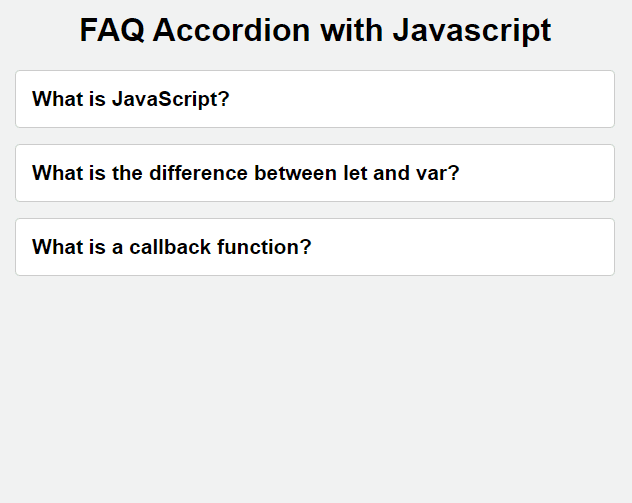

# Accordion
One of the widely used web components today is the accordion. In this project, we will address this functionality using JavaScript.

_Note: To view the project preview, click on the image above._

### Description
With a very simple code, using the DOM to add and remove classes and employing forEach to iterate through the other items in the accordion, hiding them by adding the "accordion-item--closed" class.

### Features
- Clicking opens the corresponding item in the accordion's frequently asked questions.

### How to Use
Simply click on the items.

### Installation
No installation is required.

### Dependencies
There are no dependencies.

### Technologies Used

### My Social Media
[Linkedin](https://www.linkedin.com/in/gleriston/) | [Codepen](https://codepen.io/GleristonCastro) | [Dev.to](https://dev.to/gleristoncastro) | [Youtube](https://www.youtube.com/@GleristonCastro)
______________________

# Acordeão
Um dos componentes web amplamente utilizados nos dias de hoje é o acordeão. Neste projeto, abordaremos essa funcionalidade com JavaScript.

_Observação: Para visualizar o preview do projeto clique na imagem acima._

### Descrição
Com um código muito simples, usando o DOM para adicionar e remover classes e o uso do forEach para percorrer os demais itens do acordeão e ocultá-los, adicionando a classe "accordion-item--closed."

## Funcionalidades
- Ao clicar, abre o item correspondente nas perguntas frequentes do acordeão.

## Como Usar
Basta clicar nos itens.

### Instalação
Não é necessário instalação.

### Dependências
Não há dependências.

### Tecnologias usadas

### Minhas redes
[Linkedin](https://www.linkedin.com/in/gleriston/) | [Codepen](https://codepen.io/GleristonCastro) | [Dev.to](https://dev.to/gleristoncastro) | [Youtube](https://www.youtube.com/@GleristonCastro)