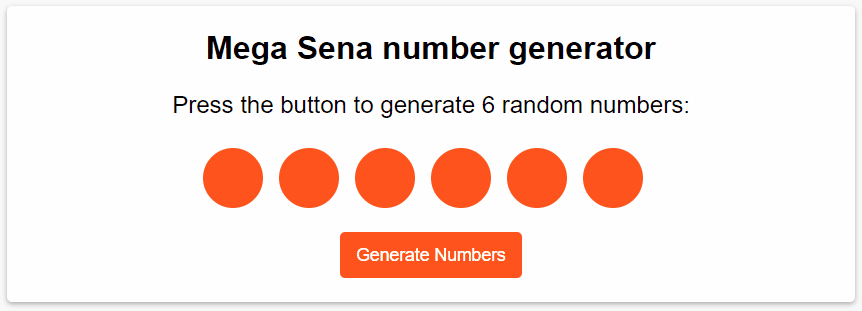

# Mega Sena Number Generator
In Brazil, Mega Sena is equivalent to the "Mega Millions - USA" game. In this project, we will focus on generating 6 random numbers

_Note: To view the project preview, click on the image above._

### Description
Mega Sena allows you to choose up to 6 numbers (a simple bet). There are other patterns that will not be covered currently (they may be implemented in the future). With the help of the Math.floor and Math.random functions, we can generate random whole numbers. Another pattern to note is that the numbers chosen for the game range from 1 to 60.

**Note:** There are no guarantees that these generated numbers will result in a lottery prize. This project is intended solely for practicing JavaScript techniques.

### Features
- Generate a sequence of 6 random numbers.

### How to Use
- Click "Generate Numbers" whenever you wish to generate new numbers.

### Installation
No installation is required.

### Dependencies
There are no dependencies.

### Technologies Used

### My Social Media
[Linkedin](https://www.linkedin.com/in/gleriston/) | [Codepen](https://codepen.io/GleristonCastro) | [Dev.to](https://dev.to/gleristoncastro) | [Youtube](https://www.youtube.com/@GleristonCastro)
______________________

# Gerador de Números da Mega Sena
A Mega Sena no Brasil equivale ao jogo "Mega Millions - USA." Neste projeto, iremos abordar a criação de 6 números aleatórios.

_Observação: Para visualizar o preview do projeto clique na imagem acima._

### Descrição
A Mega Sena permite uma escolha de até 6 números (aposta simples). Existem outros padrões que não serão abordados atualmente (podem ser implementados no futuro). Com a ajuda das funções Math.floor e Math.random, podemos criar números inteiros aleatórios. Outro padrão a ser observado é que os números escolhidos para o jogo estão na faixa de 1 a 60.

**Atenção:** Não há garantias de que esses números gerados resultarão em um prêmio na loteria. Este projeto destina-se apenas a praticar técnicas em JavaScript.

## Funcionalidades
- Gerar uma sequência de 6 números aleatórios.

## Como Usar
- Clique em "Generate Numbers" sempre que desejar gerar novos números.

### Instalação
Não é necessário instalação.

### Dependências
Não há dependências.

### Tecnologias usadas

### Minhas redes
[Linkedin](https://www.linkedin.com/in/gleriston/) | [Codepen](https://codepen.io/GleristonCastro) | [Dev.to](https://dev.to/gleristoncastro) | [Youtube](https://www.youtube.com/@GleristonCastro)