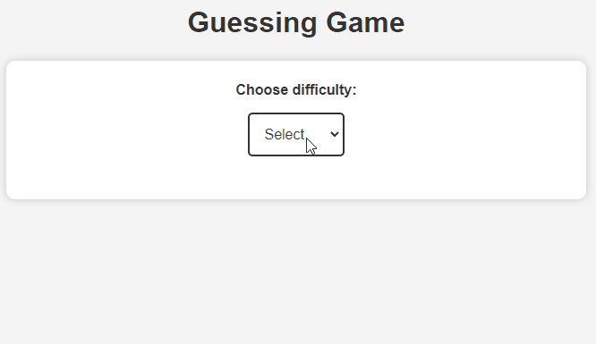

# Guessing Game
In this game, we can guess numbers, one of the most well-known games worldwide.

_Note: To view the project preview, click on the image above._

### Description
In this project, we will use JavaScript to generate a random number between 1 and 100, which the user must guess. We will provide hints of "higher" or "lower." Additionally, we offer three difficulty options to measure performance based on the number of attempts available to the player until the end of the game.

### Features
- Generates a random number.
- Allows you to choose the difficulty level.
- Displays the number of remaining attempts based on the difficulty:
  - 10 attempts for easy.
  - 7 attempts for medium.
  - 5 attempts for difficult.
- Provides a notice with the game result.

### How to Use
1. Select the difficulty level.
2. In the text field, enter a number and click "Submit."
3. Check the response to see if the number is higher or lower.
4. Repeat step 2 until you find the correct number.
5. At the end, check the result to see if you won or not.
6. f desired, restart the game.

### Installation
No installation is required.

### Dependencies
There are no dependencies.

### Technologies Used

### My Social Media
[Linkedin](https://www.linkedin.com/in/gleriston/) | [Codepen](https://codepen.io/GleristonCastro) | [Dev.to](https://dev.to/gleristoncastro) | [Youtube](https://www.youtube.com/@GleristonCastro)
______________________

# Jogo de adivinhação
Neste jogo, podemos adivinhar números, um dos jogos mais conhecidos mundialmente.

_Observação: Para visualizar o preview do projeto clique na imagem acima._

### Descrição
Neste projeto, usaremos JavaScript para gerar um número aleatório entre 1 e 100, que o usuário deve adivinhar. Forneceremos dicas de "maior" ou "menor". Além disso, oferecemos três opções de dificuldade para medir o desempenho com base na quantidade de tentativas disponíveis para o jogador até o final do jogo.

## Funcionalidades
- Gera um número aleatório.
- Permite escolher o nível de dificuldade.
- Exibe o número de tentativas restantes com base na dificuldade:
  - 10 tentativas para fácil.
  - 7 tentativas para médio.
  - 5 tentativas para difícil.
- Fornece um aviso com o resultado do jogo.

## Como Usar
1. Selecione o nível de dificuldade.
2. No campo de texto, insira um número e clique em "Enviar".
3. Verifique a resposta para saber se o número é maior ou menor.
4. Repita o passo 2 até encontrar o número correto.
5. Ao final, verifique o resultado para saber se ganhou ou não.
6. Se desejar, reinicie o jogo.

### Instalação
Não é necessário instalação.

### Dependências
Não há dependências.

### Tecnologias usadas

### Minhas redes
[Linkedin](https://www.linkedin.com/in/gleriston/) | [Codepen](https://codepen.io/GleristonCastro) | [Dev.to](https://dev.to/gleristoncastro) | [Youtube](https://www.youtube.com/@GleristonCastro)