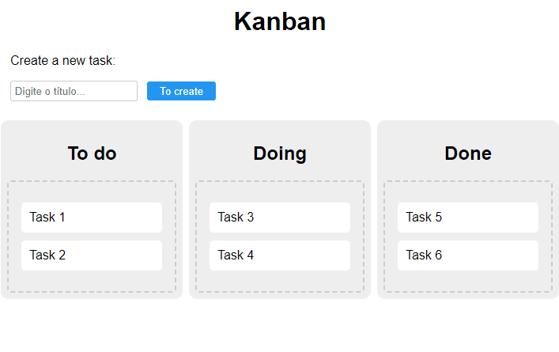

# Random Quotes
The popular predefined workflow management method. In this project, we will create a Kanban board on an HTML page using JavaScript.

_Note: To view the project preview, click on the image above._

### Description
With the help of JavaScript, especially the events (dragstart, dragover, and dragend), we can move HTML blocks to other locations and create new tasks through the form. It is also possible to interact with the columns (to-do, doing, and done).

Currently, this project supports only a single user. In future updates, we can add the option for different users with the identification of each block, as well as the ability to delete tasks.

### Features
- Create tasks.
- Move tasks between columns.

### How to Use
1. Create a task.
2. Then drag the tasks according to their current status.

### Installation
No installation is required.

### Dependencies
There are no dependencies.

### Technologies Used

### My Social Media
[Linkedin](https://www.linkedin.com/in/gleriston/) | [Codepen](https://codepen.io/GleristonCastro) | [Dev.to](https://dev.to/gleristoncastro) | [Youtube](https://www.youtube.com/@GleristonCastro)
______________________

# Kanban
O método popular de gestão de fluxo de trabalho predefinido. Neste projeto, vamos criar um quadro do Kanban em uma página HTML com o JavaScript.

_Observação: Para visualizar o preview do projeto clique na imagem acima._

### Descrição
Com a ajuda do JavaScript, especialmente os eventos (dragstart, dragover e dragend), podemos mover blocos HTML para outros lugares e criar novas tarefas por meio do formulário. Também é possível interagir com as colunas (tarefas, fazendo e feito).

Atualmente, este projeto comporta apenas um único usuário. Em atualizações futuras, podemos adicionar a opção de diferentes usuários com a identificação de cada bloco, bem como a capacidade de excluir tarefas.

## Funcionalidades
- Criar tarefas.
- Mover tarefas entre as colunas.

## Como Usar
1. Crie uma tarefa.
2. Em seguida arraste as tarefas conforme a situação que ela se encontra.

### Instalação
Não é necessário instalação.

### Dependências
Não há dependências.

### Tecnologias usadas

### Minhas redes
[Linkedin](https://www.linkedin.com/in/gleriston/) | [Codepen](https://codepen.io/GleristonCastro) | [Dev.to](https://dev.to/gleristoncastro) | [Youtube](https://www.youtube.com/@GleristonCastro)