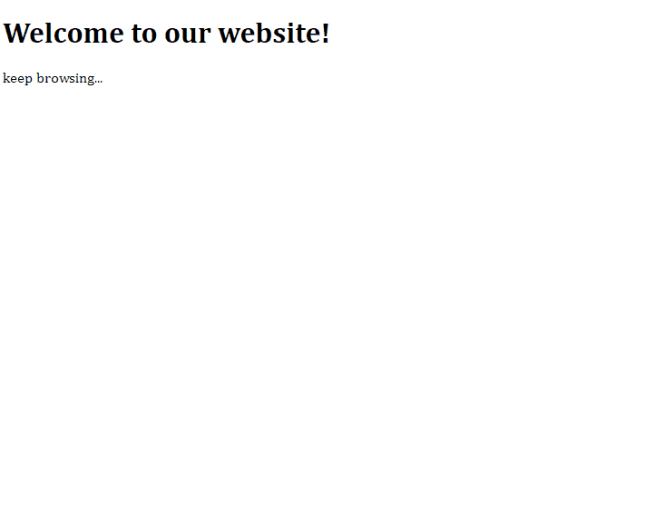

# Exit Popup
Often, when accessing some websites and attempting to close the browser tab or window, a popup appears offering a discount coupon or the opportunity to subscribe to a newsletter. There are various possibilities. In this project, we will address this topic.

_Note: To view the project preview, click on the image above._

### Description
We often encounter these alerts, and it's easier to implement than we might think. With the "mouseout" event added to the DOM document and an "if" check, we can trigger the exit popup when the user moves the mouse cursor outside the navigation area.

**Note:** The message will be displayed only once; to see it again, you need to reload the page. Typically, business rules have specific requirements, such as saving the user's choice in "localStorage" or in a database.

### Features
- Display an exit popup when the user moves the mouse cursor outside the navigation area.

### How to Use
- Move the mouse cursor outside the navigation area.

### Installation
No installation is required.

### Dependencies
There are no dependencies.

### Technologies Used

### My Social Media
[Linkedin](https://www.linkedin.com/in/gleriston/) | [Codepen](https://codepen.io/GleristonCastro) | [Dev.to](https://dev.to/gleristoncastro) | [Youtube](https://www.youtube.com/@GleristonCastro)
______________________

# Popup de saída
Frequentemente, ao acessar alguns sites, ao tentar fechar a guia ou janela do navegador, surge uma popup oferecendo um cupom de desconto ou a oportunidade de se inscrever em uma lista de boletins informativos. Existem várias possibilidades. Neste projeto, abordaremos esse tópico.

_Observação: Para visualizar o preview do projeto clique na imagem acima._

### Descrição
Muitas vezes nos deparamos com esses alertas, e é mais fácil de implementar do que imaginamos. Com o evento "mouseout" adicionado ao documento do DOM e uma verificação "if", podemos acionar a popup quando o usuário move o cursor do mouse para fora da área de navegação.

**Observação:** A mensagem será exibida apenas uma vez; para que ela apareça novamente, é necessário recarregar a página. Normalmente, as regras de negócio têm demandas específicas, como salvar a escolha do cliente em "localStorage" ou em um banco de dados.

## Funcionalidades
- Abrir uma popup de saída quando o usuário move o cursor do mouse para fora da área de navegação.

## Como Usar
- Arraste o cursor do mouse para fora da área de navegação.

### Instalação
Não é necessário instalação.

### Dependências
Não há dependências.

### Tecnologias usadas

### Minhas redes
[Linkedin](https://www.linkedin.com/in/gleriston/) | [Codepen](https://codepen.io/GleristonCastro) | [Dev.to](https://dev.to/gleristoncastro) | [Youtube](https://www.youtube.com/@GleristonCastro)