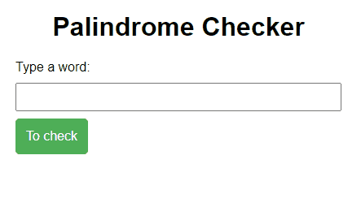

# Palindrome Checker
Palindromes are words or phrases that can be read identically from left to right or from right to left.

_Note: To view the project preview, click on the image above._

### Description
In this project, with the help of JavaScript, we can check whether a word or even a phrase is a palindrome. Using the split(), reverse(), and join() functions, we can perform this verification.

### Features
- Checks whether a word or phrase is a palindrome.

### How to Use
- Enter the word or phrase in the field and click "To check."
- Examples of palindromic words/phrases: "civic," "eye," "stats," "tut".

### Installation
No installation is required.

### Dependencies
There are no dependencies.

### Technologies Used

### My Social Media
[Linkedin](https://www.linkedin.com/in/gleriston/) | [Codepen](https://codepen.io/GleristonCastro) | [Dev.to](https://dev.to/gleristoncastro) | [Youtube](https://www.youtube.com/@GleristonCastro)
______________________

# Verificador de palíndromo.
Palíndromos são palavras ou frases que podem ser lidas da esquerda para a direita ou da direita para a esquerda de maneira idêntica.

_Observação: Para visualizar o preview do projeto clique na imagem acima._

### Descrição
Neste projeto, com a ajuda do JavaScript, podemos verificar se uma palavra ou até mesmo uma frase é um palíndromo. Utilizando as funções split(), reverse() e join(), é possível realizar essa verificação.

## Funcionalidades
- Verifica se uma palavra ou frase é um palíndromo.

## Como Usar
- Digite a palavra ou frase no campo e clique em "To check".
- Exemplos de palavras/frases palíndromas: "osso," "ala," "asa," "rapar".

### Instalação
Não é necessário instalação.

### Dependências
Não há dependências.

### Tecnologias usadas

### Minhas redes
[Linkedin](https://www.linkedin.com/in/gleriston/) | [Codepen](https://codepen.io/GleristonCastro) | [Dev.to](https://dev.to/gleristoncastro) | [Youtube](https://www.youtube.com/@GleristonCastro)