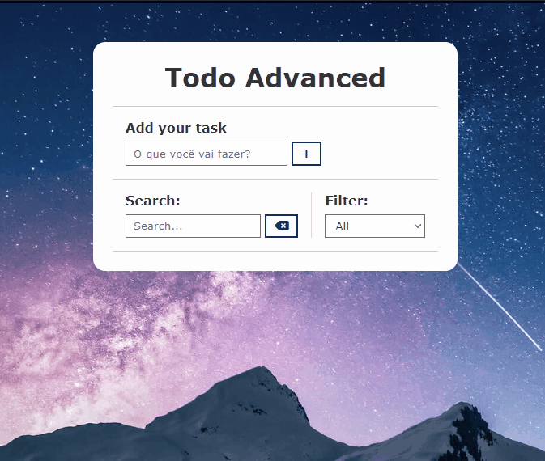

# Advanced Todo: Task Manager
More commonly known as a To-do List, which is a list of all the tasks we need to do, meaning they list everything we want to do, with the most important tasks at the top. This project was developed to manage this.

_Note: To view the project preview, click on the image above._

### Description
In addition to the traditional method of a task list, what has been developed in this project can be called Advanced Todo. In addition to listing tasks traditionally, we also save them in 'local storage,' perform searches, and filter based on status.

A desirable future feature is to create a Pomodoro timer to integrate with this Advanced Todo.

### Features
- Add a new task.
- Edit an existing task.
- Delete a task.
- Search for tasks.
- Mark a task as completed.
- Filter by status (all/done/to do).

### How to Use
1. Enter the name of one or more tasks.
2. After completing a task, click on the checkmark symbol.
3. If you prefer, you can delete a desired task.

### Installation
No installation is required.

### Dependencies
There are no dependencies.

### Technologies Used

### My Social Media
[Linkedin](https://www.linkedin.com/in/gleriston/) | [Codepen](https://codepen.io/GleristonCastro) | [Dev.to](https://dev.to/gleristoncastro) | [Youtube](https://www.youtube.com/@GleristonCastro)
______________________

# Todo Avançado: Gerenciador de Tarefas
Mais conhecido como To-do List, que é uma lista de todas as tarefas que precisamos fazer, ou seja, elas listam tudo o que desejamos fazer, com as tarefas mais importantes no topo. Este projeto foi desenvolvido para gerenciar isso.

_Observação: Para visualizar o preview do projeto clique na imagem acima._

### Descrição
Além do método tradicional de uma lista de tarefas, o que foi desenvolvido neste projeto pode ser chamado de Todo Avançado. Além de listar as tarefas tradicionalmente, também as armazenamos no 'local storage', realizamos buscas e filtragens com base no status.

Uma funcionalidade futura desejável é criar um temporizador pomodoro para integrar com este Todo.

## Funcionalidades
- Adicionar uma nova tarefa.
- Editar uma tarefa já existente.
- Excluir uma tarefa.
- Pesquisar por tarefas.
- Marcar uma tarefa como concluída.
- Filtrar de acordo com o status (todos/feitos/a fazer).

## Como Usar
1. Digite o nome de uma ou mais tarefas.
2. Após concluir uma tarefa, clique no símbolo de marca de seleção.
3. Se preferir, você pode excluir uma tarefa desejada.

### Instalação
Não é necessário instalação.

### Dependências
Não há dependências.

### Tecnologias usadas

### Minhas redes
[Linkedin](https://www.linkedin.com/in/gleriston/) | [Codepen](https://codepen.io/GleristonCastro) | [Dev.to](https://dev.to/gleristoncastro) | [Youtube](https://www.youtube.com/@GleristonCastro)