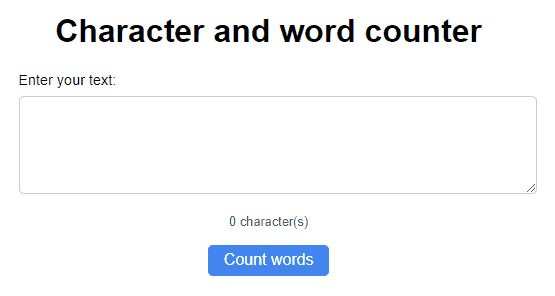

# Character and Word Counter
Often, when filling out forms on the internet, there are limitations on the number of characters or, in some specific cases, words that can be entered. Counting character by character is not a simple task. In this project, we will solve this problem.

_Note: To view the project preview, click on the image above._

### Description
With JavaScript and its split(), trim(), and length methods, we can automate this counting process.

### Features
- Counts how many characters have been provided.
- Counts how many words have been provided.

### How to Use
Type or paste text into the corresponding field, and the number of characters will automatically be counted. If you want to count words, click the "count words" button.

### Installation
No installation is required.

### Dependencies
There are no dependencies.

### Technologies Used

### My Social Media
[Linkedin](https://www.linkedin.com/in/gleriston/) | [Codepen](https://codepen.io/GleristonCastro) | [Dev.to](https://dev.to/gleristoncastro) | [Youtube](https://www.youtube.com/@GleristonCastro)
______________________

# Contador de caracteres e de palavras
Muitas vezes nos deparamentos ao preencher fomulários na internet que tem limitação de caracteres digitados ou em alguns casos especificos palavras. Não é uma tarefa simples contar caractere por caractere. Neste projeto iremos resolver este problema.

_Observação: Para visualizar o preview do projeto clique na imagem acima._

### Descrição
Com o Javascript e suas funções split(), trim() e o método length podemos automatizar essa contagem.

## Funcionalidades
- Conta quantos caracteres foram fornecidos.
- conta quantas palavras foram fornecidas.

## Como Usar
Digite ou cole uma texto no campo correspondente e que automaticamente irá se contada o número de caracteres, caso queira contar palavras clique no botão "count words".

### Instalação
Não é necessário instalação.

### Dependências
Não há dependências.

### Tecnologias usadas

### Minhas redes
[Linkedin](https://www.linkedin.com/in/gleriston/) | [Codepen](https://codepen.io/GleristonCastro) | [Dev.to](https://dev.to/gleristoncastro) | [Youtube](https://www.youtube.com/@GleristonCastro)