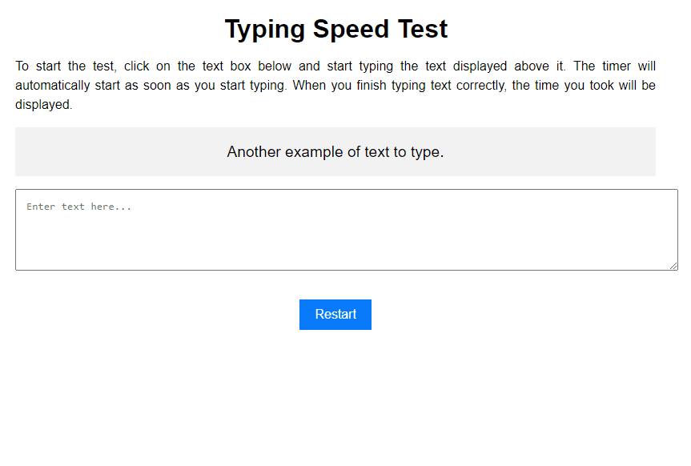

# Typing Speed Test
To improve your typing skills, we can create challenges and even turn them into a game! In that vein, I've created the typing speed test.

_Note: To view the project preview, click on the image above._

### Description
Using JavaScript and a base of example text (in an object, without the use of JSON or APIs), we can test how long it takes to type the suggested text. Detection is done automatically. There's also a history feature that allows users who take the test to track their performance. It's important to note that the test takes into account 'Case sensitivity,' meaning it distinguishes between uppercase and lowercase letters and also requires correct punctuation usage.

### Features
- Calculate the time taken to type the suggested text on the screen.
- Save the performance on the screen for tracking.

### How to Use
- Simply type the text that appears in the box with the light gray background.

### Installation
No installation is required.

### Dependencies
There are no dependencies.

### Technologies Used

### My Social Media
[Linkedin](https://www.linkedin.com/in/gleriston/) | [Codepen](https://codepen.io/GleristonCastro) | [Dev.to](https://dev.to/gleristoncastro) | [Youtube](https://www.youtube.com/@GleristonCastro)
______________________

# Teste de velocidade de digitação
Para aprimorar a digitação, podemos criar desafios e até mesmo transformá-los em um jogo! Nesse sentido, criei o teste de velocidade.

_Observação: Para visualizar o preview do projeto clique na imagem acima._

### Descrição
Com o JavaScript e uma base de texto de exemplos (em um objeto, sem o uso de JSON ou APIs), podemos testar quanto tempo leva para digitar o texto sugerido. A detecção é realizada automaticamente. Também há um histórico que permite aos usuários que realizam o teste acompanhar seu desempenho. É importante destacar que o teste leva em consideração a 'Case sensitivity', ou seja, distingue letras maiúsculas de minúsculas, e também requer o uso correto da pontuação.

## Funcionalidades
- Calcular o tempo gasto para digitar o texto sugerido na tela.
- Salvar o desempenho na tela para acompanhamento.

## Como Usar
- Basta digitar o texto que aparece na caixa com fundo cinza claro.

### Instalação
Não é necessário instalação.

### Dependências
Não há dependências.

### Tecnologias usadas

### Minhas redes
[Linkedin](https://www.linkedin.com/in/gleriston/) | [Codepen](https://codepen.io/GleristonCastro) | [Dev.to](https://dev.to/gleristoncastro) | [Youtube](https://www.youtube.com/@GleristonCastro)