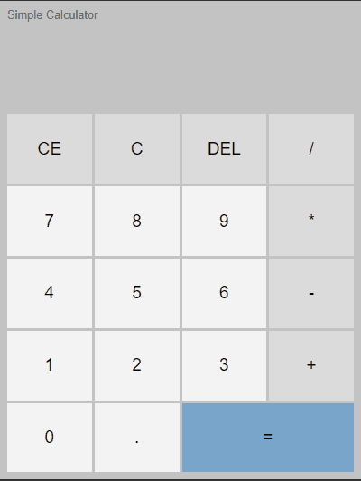

# Simple Calculator
One of the most iconic projects in any programming language is creating a calculator. Let's take an approach inspired by the Windows calculator.

_Note: To view the project preview, click on the image above._

### Description
By using the DOM manipulation capabilities along with the Object-Oriented Programming model and the utilization of classes and methods, we can maintain organized and professional code. Here, I present an approach for a simple yet highly functional calculator.

### Features
- Perform all basic mathematical operations.
- Allow partial or complete deletion (CE and C).
- Allow deletion of the last entered number.

### How to Use
1. Click on one or more numbers.
2. Choose from the operators '+', '-', '*', and '/'.
3. Click the '=' sign to complete the operation.
4. To clear everything, click 'C'.

### Installation
No installation is required.

### Dependencies
There are no dependencies.

### Technologies Used

### My Social Media
[Linkedin](https://www.linkedin.com/in/gleriston/) | [Codepen](https://codepen.io/GleristonCastro) | [Dev.to](https://dev.to/gleristoncastro) | [Youtube](https://www.youtube.com/@GleristonCastro)
______________________

# Calculadora simples
Um dos projetos mais icônicos em qualquer linguagem de programação é a criação de uma calculadora. Vamos adotar uma abordagem inspirada na calculadora do Windows.

_Observação: Para visualizar o preview do projeto clique na imagem acima._

### Descrição
Usando a capacidade de manipulação do DOM em conjunto com o modelo de Programação Orientada a Objetos e a utilização de classes e métodos, podemos manter o código organizado e profissional. Apresento aqui uma abordagem para uma calculadora simples, porém altamente funcional.

## Funcionalidades
- Realizar todas as operações matemáticas básicas.
- Permitir a exclusão parcial ou completa (CE e C).
- Permitir a exclusão do último número digitado.

## Como Usar
1. Clique em um ou mais números.
2. Escolha entre os operadores '+', '-', '*', e '/'.
3. Clique no sinal '=' para concluir a operação.
4. Para apagar tudo, clique em 'C'.

### Instalação
Não é necessário instalação.

### Dependências
Não há dependências.

### Tecnologias usadas

### Minhas redes
[Linkedin](https://www.linkedin.com/in/gleriston/) | [Codepen](https://codepen.io/GleristonCastro) | [Dev.to](https://dev.to/gleristoncastro) | [Youtube](https://www.youtube.com/@GleristonCastro)