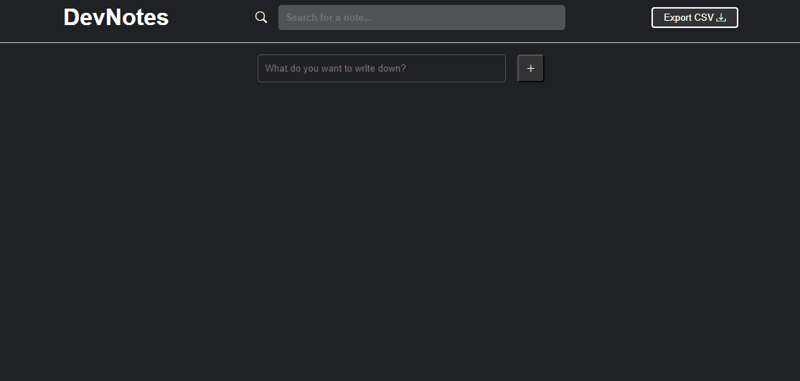

# DevNotes
Inspired by Google Keep, a note-taking tool, this is a fun and interesting project to undertake.

_Note: To view the project preview, click on the image above._

### Description
We used to use post-its in our daily lives, and nowadays, we have various apps for quickly jotting down notes. With the help of JavaScript, we can manipulate the DOM to create elements, add, remove, and perform other functions, simulating our notes virtually. It's a practical and straightforward project that utilizes 'local storage' to store information and also offers the function to export in CSV format.

### Features
- Save notes
- Edit notes
- Duplicate notes
- Delete notes
- Sort in ascending or descending order.
- Pin priority notes.
- Export in CSV format.

### How to Use
- Click on the field and type the text for a new note.
- Click on the "+" symbol to add.
- After adding, it will appear in the container, and when you hover over the note, you will have more options.
- Choose one of the options.
- There is also a search function and an option to sort alphabetically.

### Installation
No installation is required.

### Dependencies
There are no dependencies.

### Technologies Used

### My Social Media
[Linkedin](https://www.linkedin.com/in/gleriston/) | [Codepen](https://codepen.io/GleristonCastro) | [Dev.to](https://dev.to/gleristoncastro) | [Youtube](https://www.youtube.com/@GleristonCastro)
______________________

# DevNotes
Inspirado no Google Keep, uma ferramenta para guardar anotações, este é um projeto divertido e interessante de realizar.

_Observação: Para visualizar o preview do projeto clique na imagem acima._

### Descrição
Costumávamos usar post-its em nosso dia a dia, e atualmente temos diversos aplicativos para guardar anotações rápidas. Com a ajuda do JavaScript, podemos manipular o DOM para criar elementos, adicionar, remover e realizar outras funcionalidades, simulando virtualmente nossas anotações. É um projeto prático e simples que utiliza o 'local storage' para armazenar informações e também oferece a função de exportar no formato CSV.

## Funcionalidades
- Guardar anotações
- Editar anotações
- Duplicar anotações
- Excluir anotações
- Ordenar por ordem crescente ou decrescente.
- Fixar anotações prioritariamente.
- Exportar para o formato CSV.

## Como Usar
- Clique no campo e digite o texto da nova anotação.
- Clique no símbolo de "+" para adicionar.
- Após adicionar, ela aparecerá no contêiner e, ao passar o mouse sobre a anotação, você terá mais opções.
- Escolha uma das opções.
- Também há a função de busca e a opção de ordenar em ordem alfabética.

### Instalação
Não é necessário instalação.

### Dependências
Não há dependências.

### Tecnologias usadas

### Minhas redes
[Linkedin](https://www.linkedin.com/in/gleriston/) | [Codepen](https://codepen.io/GleristonCastro) | [Dev.to](https://dev.to/gleristoncastro) | [Youtube](https://www.youtube.com/@GleristonCastro)